# book author app

## Description

This is a simple app to manage authors and their books, using the following technologies:

- [React](https://reactjs.org/)
- [React-Router](https://reacttraining.com/react-router/)
- [Tailwind](https://tailwindcss.com/docs/guides/create-react-app)

## Installation

1. Clone the repository

```bash
git clone
```

2. Install dependencies

```bash
npm install
```

3. Run the app

```bash
npm start
```

## License

[MIT](https://choosealicense.com/licenses/mit/)


## Description

This is a simple app to manage authors and their books, readers can read the books

This app using CRUD operations to manage authors and books

when you open the app, you will find the home page,

if there is no books, you will find 

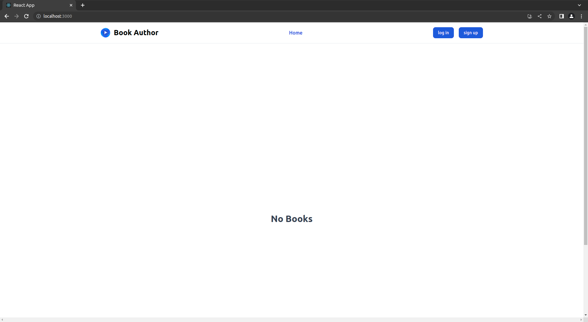

if there is books, you will find

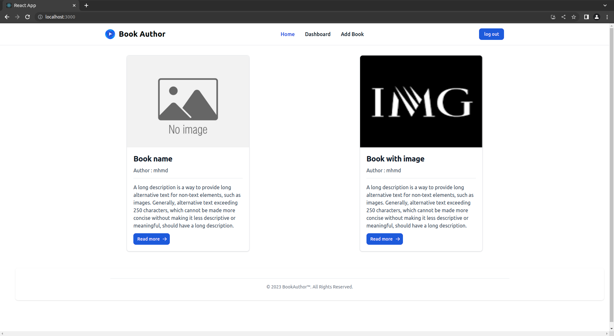

** note that you can add book with a cover image or no, as you want, as we will add default image if you didn't add a cover image

if you click on the book, you will find the book details

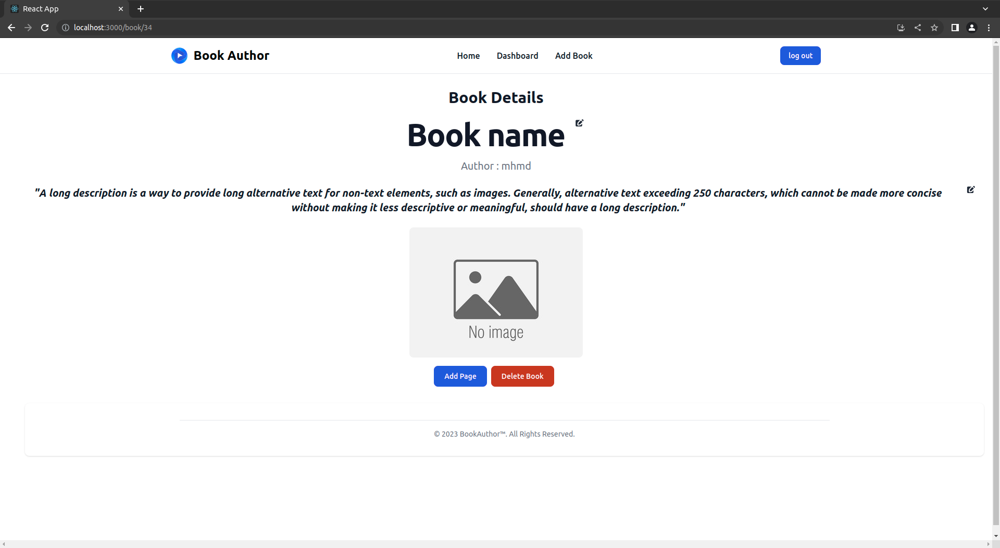

** note that you can edit the book details or delete it if you are the author of the book

if you click on edit on title

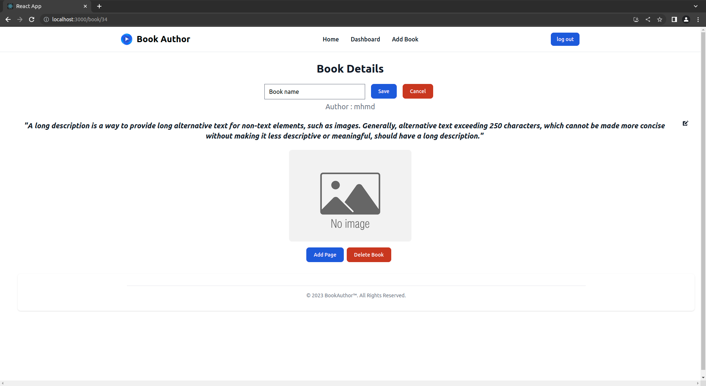

if you click on edit on description

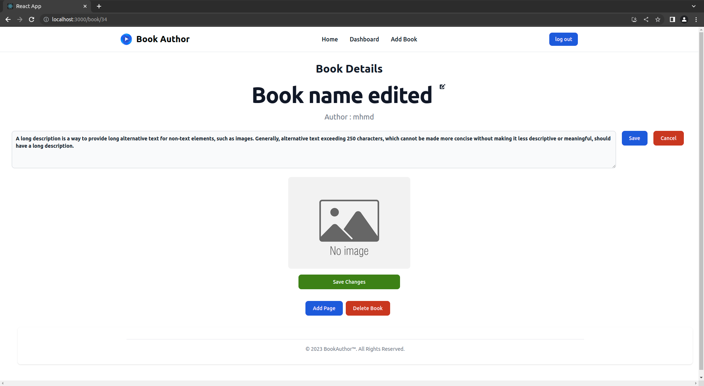

if you click on save changes 

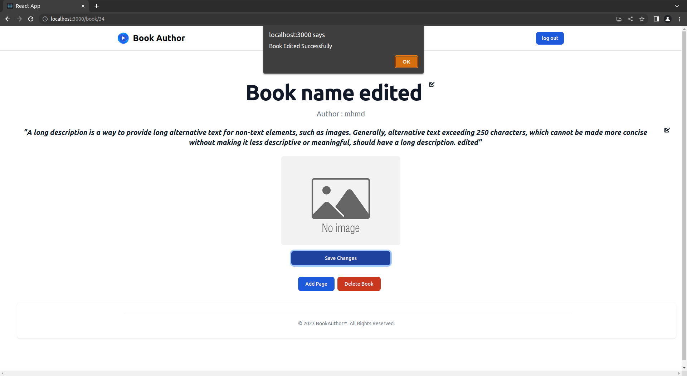

if you click on delete book

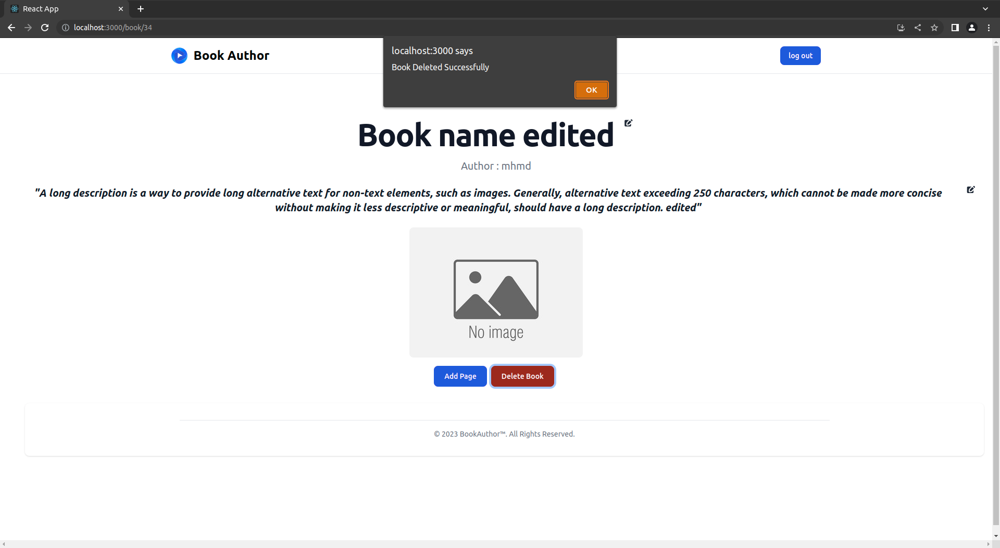

if you click on add book

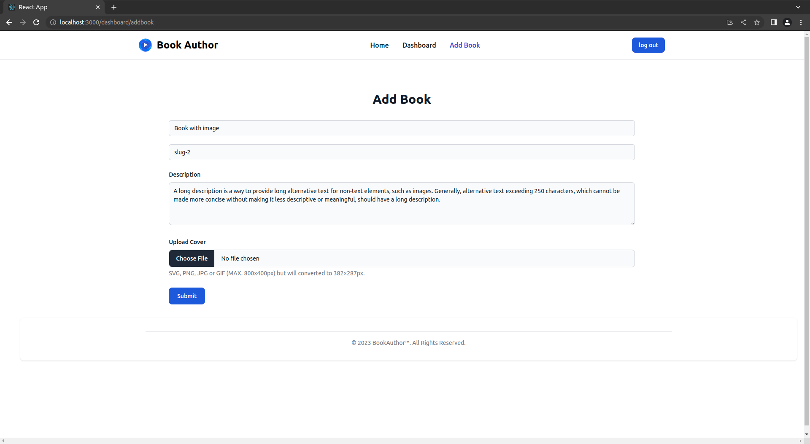

if you click on add book with cover image

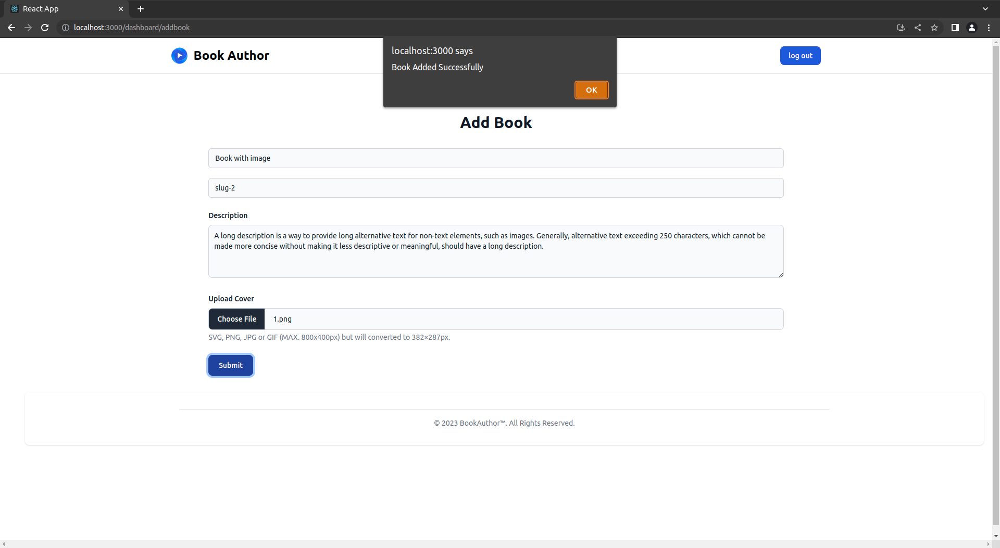

if you want to sign up

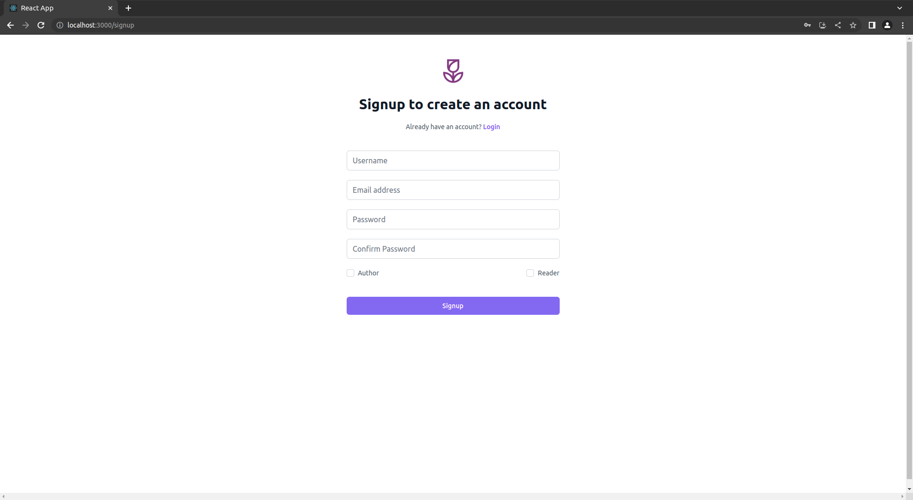

** note that you have to choose between author or reader nad you have to fill all the fields


Dashboard contains the Books you added

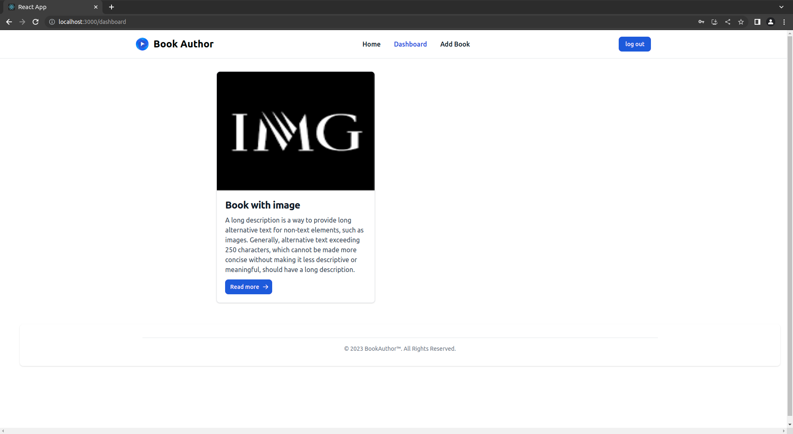

if you are the author of the book, you can add a page to a book

if you click on add page

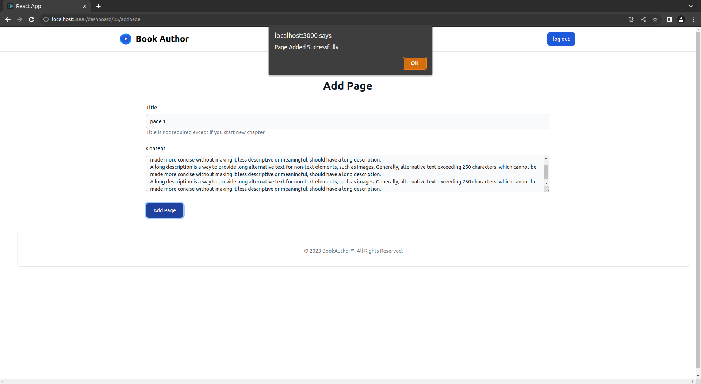

if the book contains pages, you will find new button to redirect you to the book pages

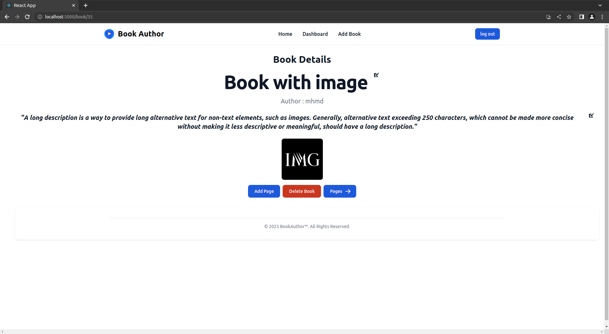

if you are in the first page, you will find only next button
and if you are in the last page, you will find only previous button
else you will find both of them

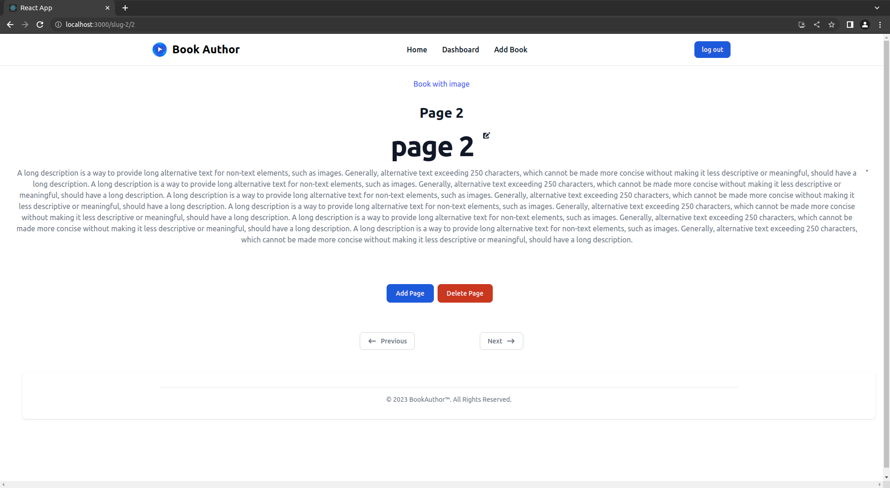

If you try to edit the title of the page

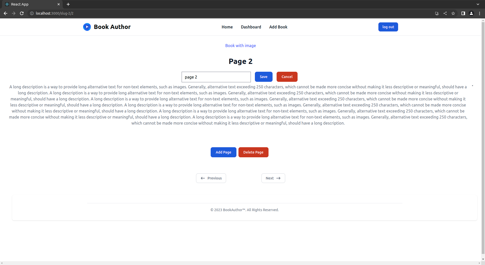


after you click on save changes

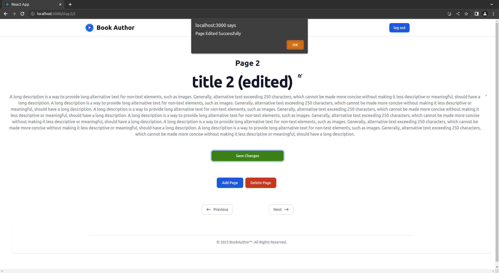

if you click on delete page

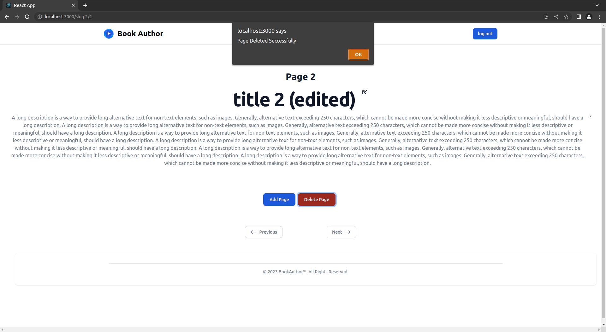

** note that if you are not the author of the book, you will not find the edit and delete buttons or add pages button

